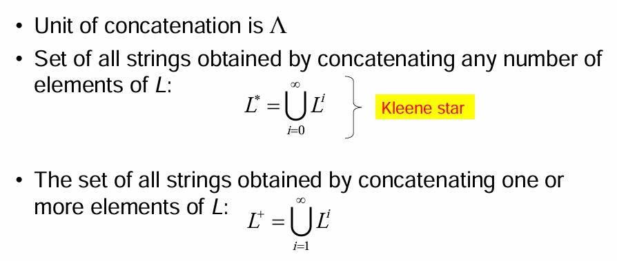

# 				  		<u>Theory of Computing</u>

## subject of interest

## Introduction

**Computation**: Computation refers to the process of executing an algorithm to solve a problem. It involves taking inputs and following a defined step-by-step procedure to produce a meaningful result. Each step in computation represents an operation that a computer can perform.

**Computers** In theoretical computer science, we do not consider real-world computers because they are too complex for abstract study. Instead, we focus on simplified abstract machines or models of computation that are mathematically defined. These models can be just as powerful as real computers when it comes to solving problems.

**Decision Problems**: Decision problems are a class of computational problems where the answer is strictly "yes" or "no." These problems play a significant role in computational theory. For example, determining whether a given positive integer *n* is a prime number is a decision problem. The number *n* is represented as a string of digits, which serves as the input to the problem.

**Languages:** A decision problem can often be expressed in terms of language recognition. A language is simply a set of strings. In the case of the prime-checking problem, the goal is to determine whether a given string (representing a number) belongs to the set of strings representing prime numbers. Recognizing languages is a fundamental aspect of computation theory.

**Models of Computation & Languages** Different abstract models of computation can recognize languages of varying complexity, leading to a hierarchy of language types. These models include:

- **Finite Automata**: Suitable for recognizing regular languages, which have simple structural patterns.
  - ![Finite Automata: Workings and Best ...](data:image/png;base64,iVBORw0KGgoAAAANSUhEUgAAAOEAAADhCAMAAAAJbSJIAAABgFBMVEX////fTwAibPVOzmqpUn2nU339//8ibPP///38/Pz8//9+fn5Pzm3//f/39/dPz2nw8PCamprn5+ff39+tra3FxcUAAADp6emfn58lJSWHh4e6urqnp6eQkJB5eXm0tLRKSkrV1dUSEhJpaWlhYWHDw8MeHh5XV1dycnKUlJRBQUExMTEXFxcsLCxQUFDgQwA5OTnWRwDqro8caPvmTQDSSAD///ahS3Lkl2jQRwD88Ob04svv3b3m+vDU9OLg+ejn9f3W5vTt+//36fPq2ea4q7Hms4rXeErXXCfITgCd5ah0y4lfx3pVxm+06L6Vs/JWgeY1ceQPXuc3deNile2jxOjDlaumaIenW3zizNjaglfB6c3G2vYdX997pOPVs8V/2oukYofTdDemRm/QYx688M6C1ZWbTG3/89nUqLxznOMAWOaiwOw8fNbxzrWR2ajgn3n0wJjmiVfgvdPidDe84vxhkfREeNv/+tes2rZRjNq5fp524Z3jmGLmvqHwz8SvKR+QAAATD0lEQVR4nO2di1/bRrbHJxBkPWyhJ5ZlWUZ+GzCBNbGbUAoBNmkTTIOThiRA2LTNo9lkk7bb9u7mbu+/fs/oYY38Co4N6fYz30+CbGmQ5zfnzJmHZgxCFAqFQqFQKBQKhUKh9MD5R10TibPF7KD0Ijfoyh8VqwwUJFSac9z3HFYgleYU+Kl4ZxAhypqfd6I3SEp97xstCE4N3icmkemRkJcWlpeXJeSkSRvqafiRL/ek5uYXU2b01KLZk6qX9FxynEyOhZzT3KMlS0jNqLptgo04/M4pLchVuJIV7HRgAWeuurwCRSHKGbCxbEDKpbIMdxAtW9AhgS4nNbuqJE3bAm+QNLNSVcHO5ZpZVZBkmXb1wqUGChdyKtLnlksL2F3FhaWksri4uLKIUGWuXJ4L7JTJOXIOlEi1OYTU0gLSUysrKxUkLeRWUnNQHsbScm0xNb+yksrJuECWy6laEhVqiys1ByxZLi8t9vfqc1RYKggCZG15CRSWUgonlGQkzqeSYMOyKCI9lwd/zXlVEqVWRDUngMKVHCiszYOFcyYnQjmZnLJSUpBVKktSKmWgbGkZ0sOvCXPg8QslFUIUB+IquIAuVmGqllqCCrdcAoVLoEbL+QpVfBpVU2VbWPazBXKlZAqs4CpUsMJ0Dtu3sgQJ7FwWWdh08+APyhJcFLOV/HwJK1zCRSRZdn6hdOEKlwwRTIXmscKc3UdhwbYF2wugdi01N1eDLEsr2EtTHYX5HCQQljRk5Azs8RJScvNILOcqWn4pje+OY/PKkq0Vli5cYc5yj4MUZnNhrJRWFs1MppKq4MyKKB0qNEEcOLoTVajOQT02wbKeDaFWfhIv9SNNr0JxbtHMo+RKSdAyy26aYg5rlmpLIldOFTKL2Ev13ELGRM5SzcyX4K0xRyhUSikjUyqBwnIpbzpKblEzSxduQyPl2bBcA4UprDAFCpcXIajLizWwQbKSStUEN42dckujUtOQM19bTBew8HytVAH7LKcW8+DsVglut5wChSm4aC2WCk4NFDoLtZKDrFoqr6cuWmE3ZF+EE8lD1+VO0Me1mCO7c8EL3D0KU+HzItmruGi4yKHrLIVCoVAoFAqFQqFQKBQKhUKhUCgUCoVCoVAoFAqF8mG4tCmYgqF86nycG+mMu2BPkjOfcqXPucGhajF4Ldl/SjNm1PA1Z366ddrnhhFZk88J/33bED6Ao0XfS5nJ3VtMKqpTzGqW4WNpaV1VpYstw549BukJrJrkVD1brcqyoRUdR1WSSUkEJAkr1rOGLFezzkUFNUvtOWWPdUNJN0zT0hxpqLeLUtEQqs6QFJNClHvPqdZH3kxyNNO2RnCBomnq5+2xfRv5j6mJSlGuGvrogbiYOed+Rl8xzojew+ly1XI+dgOJJAvn2ELpfV2K6+O6AxE1QR4zaojyKB84GnL/rMlntYei2X1C1YhATVQE9Xw2u/WLMxin2P98FMXIaGPL8+CQPHAj5Fg4g+LeB2INlDqXNbWJVh+9eh7L6Y1B3ih84BfVTGZC1gtxMucgceCeyeyw/EtpM3serZiufTjNqAx0RmVwrVCM8+mKQJlZE7/xEB2DrKvYAz17AnyocozMEF/s/1lK5hwcqQOHnEkH1CHtrNHnnCqfpz4XYcLBZsjm7O6GjkNJUzv38Q7npCd7wyFur3dX+uqA7s+EmXBNHOKlSrQwdfuCpm8m20GVhowDI9ck80y9uEmQnmiDoQ4JHBJRmFr14nbWKxOtiMP612I1eMXZF7nbdZhfjU5PNCHoKHTsC5gYY1mW/Fx2WNpRKKr4G0gYfL/r659//vn6dRbxiPEu+gqtSJlCTlh+4wtgcwO/TrDMgFEd22BwtrduYLbxS6Z/QobnGTcLiZ1dzF/dj5mIPlAI8ZFhG2j95q0vL129du2rL2/dXGf98vTqodBlZv7o9p29Fmbv+f4mSgwctSagKG58fffgpP339sG9+99s4Y/qm3GQCD8fPTh82Gw2Zx4ePngENx1QHCOi1BYQy7Prj79aXVtbu3Tp0traldXVx+teRqBTo+hdEyj80Z3WtMfs9HR87+0GP+DeXII/vnvSrk9h6vV6++TJFpRlX4UJlDg9fDEzc9llZqb59BRN6OttyjJiGu9WV7E2LNGVeWX13XVsRlAoz0UsyGz8bTo+64I1xuF/6wi8j+muNyx43db99lQsdnAQA4UxTP3kNd/tfwyGR7sPv3OluWCVzae7E7Eiv8Ex699e6mH1+3UobgigcmcQz2BnetbypE37h2ks9fkGz7Bd7gfvjw/qsYApz5BTJ/e3ulK6dRCd+tYj+e40MYEAB/6//v3VXoVYYp/Uz1qetLjrot5hdjr+vMF2K+T54zZ45lRUYizWvrfNRk2TAAs+aPYKvDzz4odx5eHgxrz8HntoH41f9Uo8anneGfcU+odpLLHBE/nGYn85iU0FAqc8hZ7Q37aZqKPy6IfmTMeGhDG/a56OGW9YlmEa3/bXB3x/vSv55t5sPPDO6eDo6ozfjoQQsNL2PSzHFecdA4X19hOeIywOaX9uhsLCiuhWxkeIH6PVgI9h0F+uDNAHjvoORQzTuNOpfRGRcQCHm/C+kKtXJzEviPreGdbI2Mk3bILMxc7D0IBdXH66M07TDzEMXf9ybaDCS1fXeaIlYI/iWCHWQ8p038Xje0RKnmdv/B3HlalejfCqfrBNljP20QEK4cyDsRRCTv6yutovzvh81iB8b2PPDZyEwlkcarx3s7NHYbcLLHR/KkrHhPV6rN5+HdYuhgETEgojMvGpnbEUMte/GiwPB5uXRPKjoA7GsbS422DEQ4f9GxlObxxE9NXrYbjBvEGExU+JMENY0g87zR9Qd5geRSL6x2pE0ZUrXW76I5H67exsvFPvOpaMBzWytdkILfP1CSlvqu1H1eDUyY1QYeJ9cyaizpcYBNbDxBgKUeIdKWlt9daPP0UVvyOKAwJpIGo23nq7v38bN4auLbE1W0eNBB+U3K9twkHvvT4+fn1AKKy3vwlvu/MiasHmDz9Hw+k4Eyc8+0/SYFffNSC0kpLX/tmph4nNVkfh7GzrWWODRftx7KdeFy4evw1u7yfeIp009gu/vY2O24QNp14FVuH4R01CzuWZ5gOEiHo4gxuMj4WTeJashldvNq5HFUJF9JtEiUNfxGfDtrD19u3encZmKx7v2HD6uS9Q5NDWCanw3q8nJ8zWAanwVz8PEutWQ99m8LN5uCOGCvFZ3OpHGDbX0NXLsxR0jbTY43ef9Sj0Q40og0KyhQDT7XUrDO4rczdIhVNT7fYb5viEiDRTv/lJ1Sz6a9PT5tXBF492HTQThtQ+Coc+zDNsgcAusKRCGFH0KLz2PxU3qVnWCIWuZ07vo3/FZyMKBe/2+UzUhjGodd+cTJE2/E3ykpqLzmmoEPppDxKHj5DrnaHCREWIsHDmmmklUSSUrnUrXOvYkKuiL1pEQwhh9Yh/FveaR/9caEN264Rs7WOvXh+jY6IDXq/fC2yoIVdh0Fl7unP6YhcdzniduP42PPvzZk5i0JdrwxUGXVMpwW6GCkFYa7/xrDVLKpx+64/2RY7dOoj02Oon0Dz8m7BhvVMPGfSIUAhqRCmR2HlPtBwj1cNuePanDyh87Mc86P1stDptIMTS/cbR2+f/Cxo756Zv43GwC7P9hlB48uTewd3E9huiHsaeBFlg0G6TaObf/3x6uoN+PiSGGd/tDpkn+RAMezPSNqz+p0vhatAegkLod093bHin4Z58TiiMfwEnPIks+4pUuA0xlnk9RShs/9LJApN4GIwNsVM2m81dNNMMhhpweLjDfLzCBHoZCTWXvn8XHe5f+5wojv1wwDTduv0WsxcqnN7jGT4wIntMeundJ19//WsYZbBockj0IOi1+Q3E+wdEn2YGut5jkGAatyKKujrhq99eD3LiOGizFbaHIZ7C+HT8X+6Mi1cYaDvS5NfxYJ9sPV6RuXj04vJMWO38F505qTEafDcr7O+rg+RhhT8GQxdtzkLoeWduxpuMisdDhbOtDaajELzyCdlti9XJTikovIGnaINM7Bz2UdgZER+ONd8GGWr0mYUKquWlL192Om0VDQ+fIuN7su2Yjb+FOsj48Ay7feCZjZyk6ch9ss2SVcuLppej3VOf78YzIWZ9wPgJguzqPzrVRVOgQ8TsxwcpjO+5s6ZMB/S6HetMIpIeOhWbOthiWWL0xKD3pAUjQpvvxxaYQDevDVCIJzGCosYPihkcO8OeW0Rh6wtvhBNOejBP2n0VxmLtY5ZtEHMeDNp5OsiGOJCOqZBlGv9Z7SMPWorHjY4JkxqYkOf5zT2vke/Y0RvmQ/sPbSsbUchu/+opxFYj9MVOXjOIb4T5xnM2u944IjISxu9mdsef9mZB4mdXu2fbQPOVzxo8H4T/ottRYvCMtxdc4sGU8Cz+1zpyy4qc92P4xPa/Y3Wylffm3E5eI653gnD3qRs/o6Fm5nB3XHlervnG71evdFsRhlLuZKOXmWCZIsNvPA/nMGb9HtzekZsqopBtcAn+NTHd5oWc9sE3KNFvxL7zvkm2EW6H9HBnQg9nwE3Wf1qNuOq1W+ssuFIn/Ff9cRfUmcb+njc/E4wWW7c3EM93K3SnKtlf3rQjlbD9agtxXO9UPUSexOnDcNYUd25mThO+64+vEP438MOn1SvYW6+sfvXt/4GHYq8L8hw8PwSFiQRo7IwS4623m8mCEzb2IQx+Isgf3z9xW8Z2vd0+eHLDP90L/Hbi9PCyN2Uz02w+hO4p23PPcVSy6OXv7x5/e+vWT5/9/hLKn4sEDuJ5PkRXlt189vb5nTt3nu8/22wgaa7QT2HA1vGT+3fvvrn/9fG235z0TweFh3ZPH7x/f/j+wc+7rl0HPbb7GLwHl+5zDDjwPNdokNGfWByFs+inwxetZUl0Bm8iwo+Hsc3wcggWT18OURhe4bJ4Lr/zxHgilgxuEjTYCVDIMj31ELmTrCzy8orUIrJL+PFiZfCoGz93Y/DuDdZ9mj5QIYNtyHqIGVzYbPC8eIK+GsH9LD87kaWI4QfiVQ6yCGo5WxzecAWrnD6QWU8gkgxXsZuBj8n6WWHDT4isNAs/VJPcNTfQI5WE4XMnZ1ToI2nuMxVf7/lBKByw0sz0fuBx7wcknuVvt4Q4+sUoRESRF/stGPKWU/mLqsT8MIn91nEOJpgvPGd1mNCp+oVL32ym24RznDB4DmzERU7BQqULUEjQK1H2F2mo/ppeTh64gEwdZdkvN6JPTwrRJFad4K0WGSd4nQkibbba82sew5aW9TJsMeG5kiU3QJNrTZOdWqZW+k9maiOta8x8sh26nCVYTjKZVHRDiEQefxYaW9bsu3BypP3v3AR36I6OoqctrdizB68SvtT7xaSRFv1qF7GpdFQUQoJY7alGyiihVPykJhxIlvRax+6yQnqU7VHyH/S7AKK+mTYjmqojhI7Bf6nwU1OJqBCtTGhHaYRq6JzfRtJxEbu6rqJmB3a0zu536h+zEnpIdneTUKwU3VOVPqn7o/9xLYhJ9g4v9Iyh9t8L3w/R+FSdmbMi9dlwnsyahbM4KYdb0onvSJ08Zu8gixOSln2GmujkJ7yf65xIQy+cCKoJJLnDRkmz5XRycJsB1/879AHJjEV26RyB8/86LedoGdly1O4OHwe93Mz42/kvErUaDByR07XblFOcrGFkMrKWdtHkDFb9B+3EDEFMZ4SqZQiZtNj3r9XhL6lRAKnz3S5/ti80+jNAbUKhUCiUAG82v++VC87JJCHHehKS1HP4fkVuwr04vdB9xhlkAi2f54jUYhYV9L7zRmLB3dzumTi8Wb8OnL1sd/e6JYFIOoECFMwkZ1aSVt7RhQyyzWpyRZYqlWRa0CwhMqRx1RVQpuLotqxWTE7WF9IZZAq6LhiaTWh1TDylmEFGJc/ZyBTTgsxVbBlV82ratjjbdirVYM1JAYlCHnKgpM2Co1cMsSKYqoUElClIWTst2aZuj7U9X8lbhmogyUYoby0n8ygPRWg4ajWbRtXo95ioppshHUYGpuQIqihA9gU1b5m6gYzId58V88mKUUiWIXkeVaRydoWroDI2znJ2HkpKrSioo1DKI07PpLO6o+kZqZiWBFVGeTzptpIuQMaK5ljfx2dZesExpWRekmzHEcvJZbEiZrO6kdWRpEfnz+aTSQSJNVlU50VlgRPECrKVvKKk0yipEv4rJdOaWXS4srgMuhbEgupA0oJYkST8Mg/1txAUSBl7ZVq2sprjWKJa1g3VTppqQREksayoSQHByXE2BsEAR0+mq5KTUSVDAzvqqGghzeAcBaWNaBVRMxaXFY2i41QdVc6iIpdGabCpo6qQR2KeO1m1RMmwkGOV4XKag8SimzSjKHIWfkuVO/6fRWIRSXJadRTFcWQdWVC2lgbJoSDlIlzEJydG96Tn2Jx9IvGimPQX7Fzc96FQKBQKhUKhUCgUCoVCoVAoFAqFQqFQKBQKhUKhUCgUCoVCoVAoFAqFQpkQ/w9evB+YewbnwwAAAABJRU5ErkJggg==)
- **Pushdown Automata**: More powerful than finite automata, capable of recognizing context-free languages, which include many programming language grammars.
  - 
- **Linear-Bounded Automata**: A type of Turing machine with limited memory, used for recognizing context-sensitive languages.
  - 
- **Turing Machines**: The most powerful model of computation, capable of recognizing any computable language and solving problems that can be algorithmically defined.
  -    

- 

> [!TIP]
>
> **Finite Automata**: A finite automaton (FA) is a computational model that operates with a finite number of states. At any given moment, it is in one of these states and transitions between them in a predictable manner based on input symbols. FA is primarily used to recognize **regular languages** and is limited by its lack of memory.
>
> **Pushdown Automata**: A finite automaton has little or no memory, restricting it to recognizing only simple languages. To overcome this limitation, **pushdown automata (PDA)** are introduced. A PDA is essentially a finite automaton equipped with an **auxiliary stack memory**, allowing it to recognize **context-free languages**. These are crucial in describing the syntax of programming languages, as they can process nested structures and recursive patterns.
>
> **Turing Machines**: A pushdown automaton is still not a general model of computation, as it lacks the ability to handle more complex operations. A **Turing machine (TM)**, on the other hand, is a general computing device capable of performing any step-by-step algorithm. It can recognize **more general languages** than both FA and PDA and serves as the theoretical foundation of modern computing. A Turing machine can theoretically perform any computation that a real computer can execute.

> [!CAUTION]
>
> **Is Every Problem Solvable?**
>
> • Turing machines can still have limits, but there is no more powerful machine. • Some problems are **unsolvable**, no matter how much time and resources we have. • **Computability theory** explores these limitations using the Turing machine as the computational model.
>
> **Kinds of Solvable Problems**
>
> • Some problems are **intractable**—they can be solved in theory but require impractical amounts of time or resources.
>
>  • **Complexity theory** studies why some problems are computationally easy while others are hard.
>
>  • Understanding computational complexity helps in classifying problems based on their feasibility in real-world applications.

## Symbols,Languages,strings,alphabet

### **Mathematical Background**

Before delving deeper into the Theory of Computing, a fundamental understanding of mathematical concepts is required. The key areas include:

- **Sets** – Basic set theory, notation, and operations.
- **Logic** – Propositional logic, implication, equivalence, and quantifiers (∀, ∃).
- **Functions and Relations** – Understanding mappings between sets and relationships.
- **Mathematical Induction and Proofs** – Used to establish truths in computing.
- **Recursion and Recursive Definitions** – Fundamental in defining computational processes.

------

### **1. Symbols (Basic Unit)**

- A **symbol** is an atomic, indivisible entity.
- It is a single element from a **finite set** called an **alphabet (Σ)**.
- Example: If Σ = {a, b, c}, then **'a'**, **'b'**, and **'c'** are symbols.

------

### **2. Alphabet (Set of Symbols)**

- An **alphabet (Σ)** is a **finite set of symbols** used to form strings.
- Each language operates over a specific alphabet.
- Example:
  - The English alphabet is **Σ = {A, B, C, ..., Z}**.
  - A binary alphabet is **Σ = {0,1}**.
  - A symbolic alphabet might be **Σ = {&, %, #, @}**.

------

### **3. Strings (Sequence of Symbols)**

- A **string** is an ordered **sequence of symbols** from an alphabet.
- The **length** of a string is the number of symbols it contains.
- The **<u>Null string (Λ or ε)</u>** has a length of **0**, which belongs to any Σ..
- The **length** of a string x over Σ is denoted as |x|.
- <mark>The set of all possible strings over Σ is denoted by Σ∗</mark>. Σ∗ :  Σ කියන ඇල්ෆබට් එකෙන් හදන්න පුලුවන් සියලුම string combinations අඩංගු කුලකය -> එනිසා ඇල්ෆබට් එකෙන් හදන ඕනෑම language එකක් මේකේ subset එකක් වෙනවා.
- Example:
  - If **Σ = {a, b}**, then **"abba"** is a string over Σ.
  - If **Σ = {0, 1}**, then **"1010"** is a string over Σ.

------

### **4. Languages (Set of Strings)**

- A **language (L)** is a **set of strings** formed using symbols from an alphabet.
- A language may be **finite** (having a limited number of strings) or **infinite**.
- <mark>A **language over Σ** is any subset of Σ∗</mark>.
- 
- Example:
  - If **Σ = {a, b}**, then one possible language is **L = {a, ab, abb, ba}**.
  - The language of all binary numbers with an even number of **1s** over Σ = {0,1} is **L = {ε, 11, 1010, 1100, ...}**.ෂ්ෂ්

------

### **How They Are Connected**

1. **Symbols** are the **basic building blocks** of computation.
2. A **set of symbols** forms an **alphabet (Σ)**.
3. **Strings** are **finite sequences of symbols** from the alphabet.
4. A **language (L)** is a **set of strings**, usually following specific rules or patterns.

### **Illustrative Example**

Imagine we define an alphabet:

Σ={0,1}

- Possible **symbols**: 0, 1
- Possible **strings**: "0", "1", "00", "01", "10", "11", "101", etc.
- Example **language**: **L = {ε, "0", "1", "10", "11"}** (a specific subset of all possible strings).

### **Operations on Languages**

Languages are treated as sets and can undergo various operations:

- **Union (L₁ ∪ L₂)** – The set of strings that belong to either L₁ or L₂.
- **Intersection (L₁ ∩ L₂)** – The set of strings common in both L₁ and L₂.
- **Difference (L₁ - L₂)** – The set of strings in L₁ but not in L₂.
- **Complement (L')** – The set of strings in Σ∗ that are not in L.  ( L' = Σ∗ - L )

### **Concatenation of Strings and Languages**

- If **x** and **y** are strings -> ( if x and y are elements of Σ∗   )    , their concatenation is written as **xy**.
- Concatenation follows properties such as:
  - 

If **L₁** and **L₂** are languages:

- Their concatenation L1L2 is the set of all strings formed by taking one element from L₁ and one from L₂.

### **Exponentiation and Repetition in Languages**

 

> a-symbol x-string l-language

### **Prefixes, Suffixes, and Substrings**

- A **prefix** of a string is an initial substring. Example: "abb" is a prefix of "abba".
- A **suffix** is a final substring. Example: "bba" is a suffix of "abba".
- A **substring** of a string is any part of it, occurring consecutively.

### **Kleene Star and Kleene Plus**

- The **Kleene Star (L\*)** – The set of all possible concatenations of zero or more elements from L.

- The **Kleene Plus (L⁺)** – Similar to Kleene Star but excludes the empty string.

- 

- 

- > This equation tells us that **L⁺ (one or more repetitions of L) can be rewritten as L\*L or LL\***.
  >
  > - **L\*L** means:
  >   - First, pick **any string from L*** (which includes the empty string).
  >   - Then, concatenate it with **a string from L**.
  >   - This ensures that at least **one** L-string is always present.
  > - **LL*** means:
  >   - First, pick **a string from L** (ensuring at least one occurrence).
  >   - Then, concatenate it with **any string from L*** (which could be empty or more repetitions).
  >
  > Since **both L\*L and LL\*** ensure at least one occurrence of L, they are equivalent to **L⁺**.

### **Recognition of Languages**

The way we describe constructing a language is also used to recognize its strings. This is essential in automata theory, where abstract machines determine whether a string belongs to a language.

## **Conclusion**

- The section covered **basic mathematical concepts** essential for computation.
- It introduced **languages, operations, and string manipulations** as part of theoretical computing.
- The next topics will focus on **Regular Languages, Regular Expressions, and Finite Automata**.